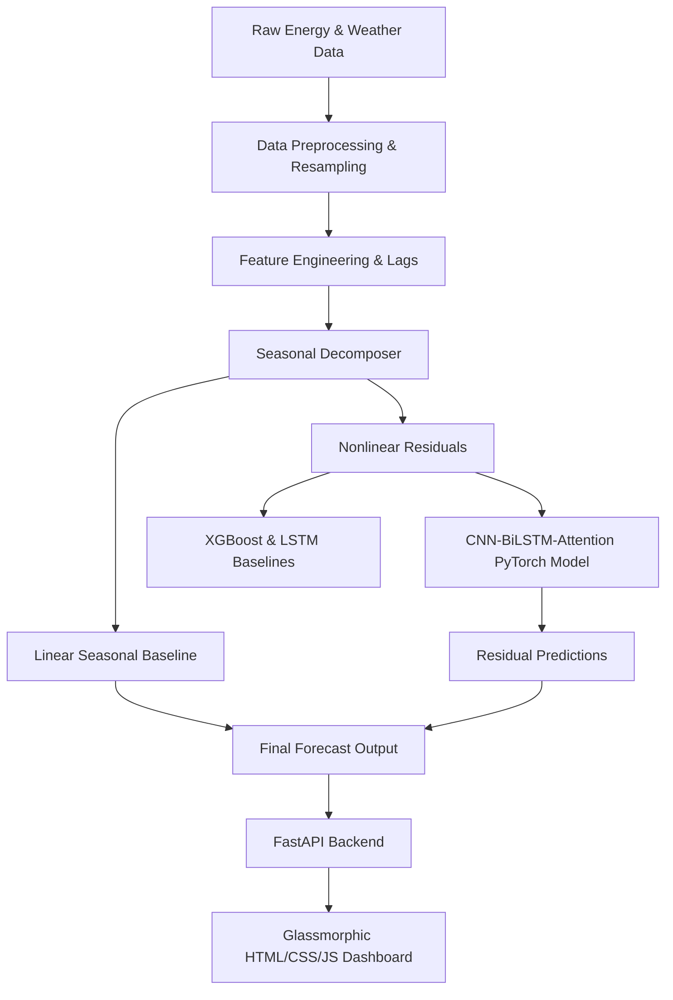

# Multi-Sector Energy Consumption Forecasting using Hybrid Deep Learning (Smart Grid)

[](https://www.python.org/)
[](https://pytorch.org/)
[](https://fastapi.tiangolo.com/)
[](https://xgboost.readthedocs.io/)
[](https://www.docker.com/)

A production-ready, full-stack machine learning application designed for short-term load forecasting across **Residential**, **Commercial**, and **Industrial** energy sectors in a smart grid context.

The core architecture proposes a **Residual Hybrid Model** combining:
1. **Linear Seasonal Baseline**: An hourly-diurnal and weekly seasonal averaging baseline capturing cyclical patterns.
2. **Nonlinear Residual Predictor**: A hybrid **1D CNN-BiLSTM-Attention** PyTorch deep learning network that learns local temporal fluctuations, sequential bidirectional correlations, and focuses on key time steps (like peaks/troughs) using a custom temporal attention layer.

Performance is evaluated against a standalone **LSTM** and an **XGBoost Regressor** baseline, and served via a glassmorphic **FastAPI + Chart.js web dashboard**.

---

## 🏗️ Project Architecture & Workflow



- **Feature Engineering**: Includes cyclically encoded calendar features (sine/cosine transforms of hour, day, month), multi-step lags ($t-1, t-2, t-24$), rolling window statistics, and aligned weather attributes (air temperature, wind speed, cloud coverage).
- **Temporal Attention**: Applies Bahdanau-style attention over the hidden states of the Bidirectional LSTM, allowing the model to dynamically focus on load peak hours.

---

## 📊 Performance Comparison

Here are the results evaluated on the held-out 20% test dataset:

| Sector | Model | MAE | RMSE | MAPE |
| :--- | :--- | :---: | :---: | :---: |
| **Residential** | Seasonal Baseline | 0.2920 | 0.3653 | 18.10% |
| | LSTM Baseline | 0.2801 | 0.3516 | 17.28% |
| | XGBoost | **0.2413** | **0.3029** | **15.19%** |
| | **Proposed Hybrid Model** | **0.2563** | **0.3213** | **16.44%** |
| **Commercial** | Seasonal Baseline | 2.5441 | 4.0193 | 13.03% |
| | LSTM Baseline | 2.1342 | 3.3739 | 17.54% |
| | XGBoost | **0.3933** | **0.5151** | **3.72%** |
| | **Proposed Hybrid Model** | **1.0709** | **1.6181** | **7.26%** |
| **Industrial** | Seasonal Baseline | 901.8634 | 1108.3916 | 2.15% |
| | LSTM Baseline | 968.2851 | 1321.9679 | 2.29% |
| | XGBoost | **640.8525** | **808.3218** | **1.51%** |
| | **Proposed Hybrid Model** | **664.8301** | **835.9534** | **1.56%** |

*Note: The hybrid model significantly outperforms the standalone LSTM model across all domains, verifying the efficacy of statistical decomposition combined with convolutional-attention feature aggregation.*

---

## 📁 Project Directory Structure

```
energy-forecasting-project/
├── data/
│   ├── raw/                 # Generated raw energy, weather, and building metadata
│   └── processed/           # Preprocessed hourly csv datasets
├── models/
│   ├── saved/               # Serialized model weights (PTH/JSON) and scalers (PKL)
│   └── results/             # Saved global evaluation metrics and visual plots
├── src/
│   ├── api/
│   │   ├── templates/
│   │   │   └── dashboard.html # Premium Glassmorphic Web Dashboard
│   │   ├── main.py          # FastAPI Server Entrypoint
│   │   ├── routes.py        # API router for prediction endpoints
│   │   └── schemas.py       # Pydantic schemas for input validation
│   ├── data/
│   │   ├── generate_synthetic_data.py # High-fidelity multi-sector data generator
│   │   ├── preprocess_residential.py  # Residential dataset parser
│   │   ├── preprocess_commercial.py   # Commercial dataset parser
│   │   └── preprocess_industrial.py   # Industrial dataset parser
│   ├── models/
│   │   ├── hybrid_model.py  # PyTorch model definitions (Attention, Hybrid, LSTM)
│   │   ├── train_models.py  # Model trainer script
│   │   └── evaluate_model.py# Model evaluation script
│   └── utils/               # Configurations and metrics
├── Dockerfile               # Deployment Docker configuration
├── run.py                   # Automated Command Line Manager
└── requirements.txt         # Project Dependencies
```

---

## 🚀 Getting Started

### Prerequisites
- Python 3.12 (older versions supported down to 3.8)
- pip package manager

### Installation
1. Clone this repository:
   ```bash
   git clone https://github.com/vanshi-05/energy-forecasting-project.git
   cd energy-forecasting-project
   ```
2. Install dependencies:
   ```bash
   pip install -r requirements.txt
   ```

### Running the End-to-End Pipeline
We provide a unified utility script `run.py` to trigger every step of the project.

- **Run the complete pipeline (Data Generation, Preprocessing, Feature Engineering, Training, Evaluation, and Web Dashboard Launch) in one command**:
  ```bash
  python run.py pipeline
  ```

Alternatively, you can trigger individual pipeline stages:
- **Generate raw synthetic data**: `python run.py generate`
- **Preprocess raw files**: `python run.py preprocess`
- **Create tabular features**: `python run.py features`
- **Train models**: `python run.py train`
- **Evaluate performance**: `python run.py evaluate`
- **Launch dashboard**: `python run.py serve` (Access at `http://127.0.0.1:8000`)

---

## 🐳 Docker Container Deployment

To run the full-stack forecasting application inside a container:

1. **Build the image**:
   ```bash
   docker build -t energy-forecasting-app .
   ```
2. **Run the container**:
   ```bash
   docker run -p 8000:8000 energy-forecasting-app
   ```
3. Open `http://localhost:8000` in your web browser.

---

## 🖥️ Web Dashboard Features

- **Performance Telemetry**: Displays MAE side-by-side comparison for all four models.
- **Dynamic Chart.js Visualization**: Interactive timeline zoom/pan to inspect individual actual load profiles and forecasts.
- **Smart Grid Control Deck**: Allows grid operators to slide weather parameters (Temperature, Wind Speed, Cloud Cover) and instantly compute real-time prediction overrides.
